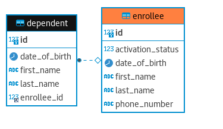
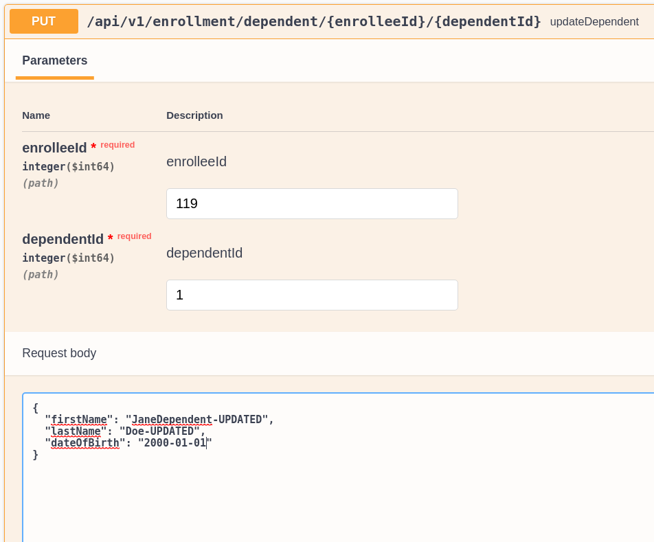
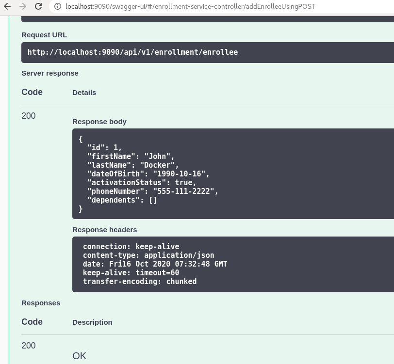

# Enrollment Service

## Indroduction
Enrollment Service is a spring boot based microservice part Health Plan Member System. Enrollee is a Health Plan subscriber with dependents. Enrollment Service tracks demographics and status of the members.

## Requirements: 
- Enrollees must have an id, name, and activation status (true or false), and a birth date
- Enrollees may have a phone number (although they do not have to supply this)
- Enrollees may have zero or more dependents
- Each of an enrollee's dependents must have an id, name, and birth date

The Enrollee Microservice should  be able to do handle below operations: 
- Add a new enrollee
- Modify an existing enrollee
- Remove an enrollee entirely
- Add dependents to an enrollee
- Remove dependents from an enrollee
- Modify existing dependents

## Technology Components
- Spring Boot with JPA for Micro Service
- MySQL for database
- Maven for build automation
- Java (OpenJdk 8 or higher)

## Entity Class Diagram

## Swagger UI Rest End Points
http://localhost:8080/swagger-ui/

## Swagger UI Enrollment Service Test Cases

### Add Enrollee Request

### Add Enrollee Response

### Add Enrollee Database Record

### Update Enrollee Request

### Update Enrollee Response

### Update Enrollee Database Record

### Get Enrollee Request

### Get Enrollee Response

### Delete Enrollee Request

### Delete Enrollee Response

### Delete Enrollee Database Record

---
### Add Dependent Request

### Add Dependent Response

### Add Dependent Database Record

### Update Dependent Request

### Update Dependent Response

### Update Dependent Database Record

### Get Dependent Request

### Get Dependent Response

### Delete Dependent Request

### Delete Dependent Response

### Delete Dependent Database Record

## Maven Test Result

 
 
# Docker Container

1. Run the  command `./mvnw clean install` from the enrollment home folder
2. Should create the application jar file in target folder: `./target/enrollment-0.0.1-SNAPSHOT.jar`
3. Build the enrollment service docker image by running the command `./docker-run.sh`

4. Above command will start the Enrollment application in the container with host port 9090
5. Start swagger at port 9090 `http://localhost:9090/swagger-ui/` 
6. Add enrollee as shown below:

7. Should get a successful response as below:
